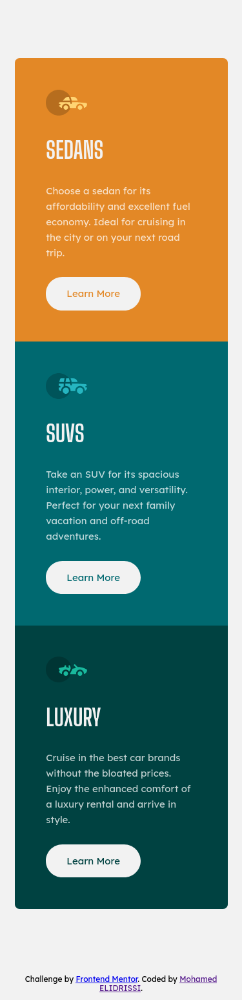
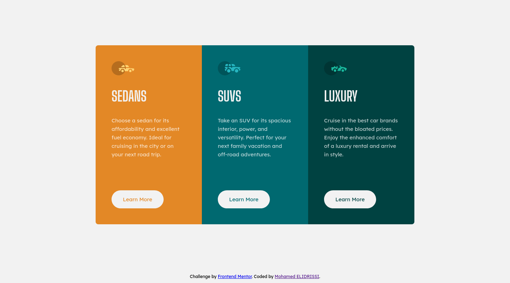

# Frontend Mentor - 3-column preview card component solution

This is a solution to the [3-column preview card component challenge on Frontend Mentor](https://www.frontendmentor.io/challenges/3column-preview-card-component-pH92eAR2-). Frontend Mentor challenges help you improve your coding skills by building realistic projects. 

## Table of contents

- [Overview](#overview)
  - [The challenge](#the-challenge)
  - [Screenshot](#screenshot)
  - [Links](#links)
- [My process](#my-process)
  - [Built with](#built-with)
  - [What I learned](#what-i-learned)
  - [Useful resources](#useful-resources)
- [Author](#author)
- [License](#license)

## Overview

### The challenge

Users should be able to:

- View the optimal layout depending on their device's screen size
- See hover states for interactive elements

### Screenshot

| Mobile (375px) | Desktop (1440px) |
| --- | --- |
|  |  |

### Links

- [Solution URL](https://www.frontendmentor.io/solutions/second-take-with-fixed-alignment-and-other-improvements-qbeKGTgQj)
- [Live Site URL](https://3-column-preview-card-component-elidrissidev.vercel.app/)

## My process

### Built with

- Semantic HTML5 markup
- CSS custom properties
- Flexbox
- Mobile-first workflow
- [Parcel](https://parceljs.org/)

### What I learned

This is my second take on this challenge after completing it 5 months ago, this time I was able to make it a lot faster and better! Not only did I fix issues with alignment but I also worked on making it a bit more accessible by adding missing landmark elements and adding a hidden `h1` on the page.

### Useful resources

- [Revisting aria-label versus a visually hidden class ](https://gomakethings.com/revisting-aria-label-versus-a-visually-hidden-class/) - This article helped clear some things to me when it comes to `aria-label` vs. "visually hidden" labels.

## Author

- Website - [Mohamed ELIDRISSI](https://www.elidrissi.dev)
- Frontend Mentor - [@elidrissidev](https://www.frontendmentor.io/profile/elidrissidev)

## License

This project is licensed under the [MIT License](LICENSE.txt).
